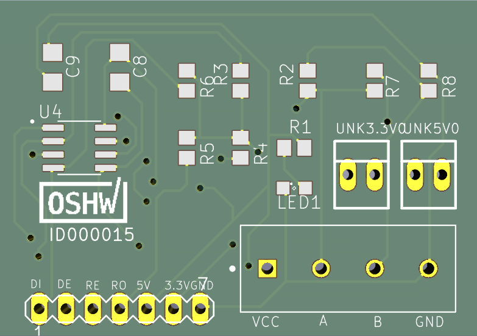
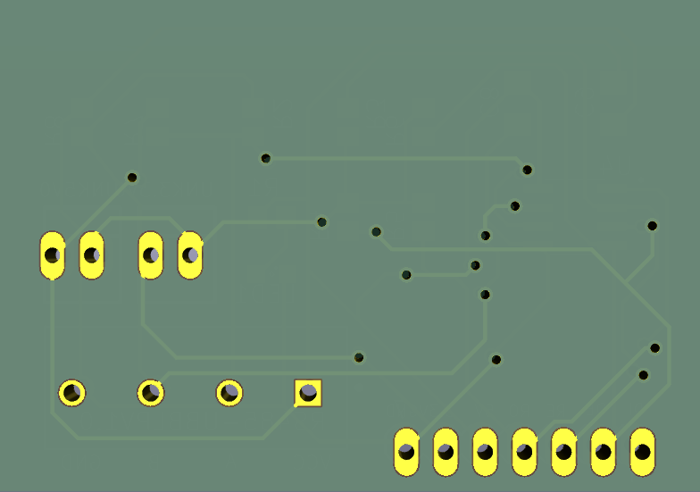

-----

# RS-485LP (Low Power RS485 Node)

[](https://www.gnu.org/licenses/gpl-3.0)
[](https://platformio.org/)

**RS-485LP** is an open-source RS485 converter featuring a custom PCB and optimized PlatformIO firmware. It is designed to minimize power consumption for battery-operated sensors and remote monitoring systems.

🔗 **Official Project Website:** [https://belenseptian.github.io/RS-485LP/](https://belenseptian.github.io/RS-485LP/)

-----

### 📟 Board Design Preview
Below are the top and bottom views of the RS-485LP PCB.

| Top View (Components) | Bottom View (Traces) |
| :---: | :---: |
|  |  |

-----

## 🚀 Features

  * **Sleep & Shutdown Optimization:** Optimized for deep-sleep and hardware shutdown modes to achieve micro-amp current draw during periods of inactivity.
  * **RS485 Protocol:** Reliable differential signaling for long-range data transmission.
  * **PlatformIO Integrated:** Easy-to-compile and upload firmware using VS Code.
  * **Compact Form Factor:** Small PCB footprint suitable for tight enclosures.

-----

## 🛠 Hardware Fabrication

### 1\. Obtain KiCad Files

The PCB design is created using **KiCad**. You can find the project files in the `pcb/` directory.

1.  Clone this repository to get the full KiCad project.
2.  Open the project in KiCad to view the schematic or modify the layout.

### 2\. Ordering from PCBWay (or similar)

Most modern PCB manufacturers allow you to upload the KiCad file directly:

1.  **Option A (Direct):** Upload the `.kicad_pcb` file from the `pcb/` folder directly to [PCBWay's Instant Quote](https://www.pcbway.com/).
2.  **Option B (Manual Gerber Export):** - In KiCad, go to **File \> Fabrication Outputs \> Gerbers (.gbr)**.
      - Generate the drill files and zip all outputs together.
      - Upload the resulting `.zip` file to the manufacturer.

-----

## 💻 Software Setup

This project uses **PlatformIO** inside **Visual Studio Code**.

### Prerequisites

  * **VS Code:** [Download here](https://code.visualstudio.com/)
  * **PlatformIO IDE Extension:** Install this via the VS Code Extensions marketplace.

### Project Installation

1.  Clone the repository:
    ```bash
    git clone https://github.com/belenseptian/RS-485LP.git
    ```
2.  Open VS Code and go to **PlatformIO Home** \> **Open Project**.
3.  Navigate to the `firmware/` folder and select it.

-----

## 📤 Uploading & Testing Sleep Mode

1.  **Connect Hardware:** Connect your board to your computer using a USB-to-Serial adapter.
2.  **Build & Upload:** Use the **Checkmark (✅)** to compile and the **Arrow (➡️)** to flash.
3.  **Verify Shutdown:**
      - Open the **Serial Monitor (🔌)** (Baud rate: `115200`).
      - The monitor should display "Entering Sleep Mode..." or "Shutting Down...".
      - Use a Multimeter or Power Profiler to measure the current draw; it should drop significantly as the MCU enters the deep sleep/shutdown state.
4.  **Wake-up Trigger:** Ensure you have configured the wake-up source (e.g., Timer or External Interrupt on the RS485 RX pin).

-----

## 🔌 Wiring Diagram

| Pin Name | Description | Connection |
| :--- | :--- | :--- |
| **VCC** | Power Input | Depend on the sensor specifications |
| **GND** | Ground | Ground |
| **A** | RS485 Data+ | Connect to Bus A |
| **B** | RS485 Data- | Connect to Bus B |

-----

## 📂 Project Structure

```text
RS-485LP/
├── firmware/           # PlatformIO project files
│   ├── src/            # Main application code (Sleep/Shutdown logic)
│   └── platformio.ini  # Project configuration
├── pcb/                # KiCad project files (.kicad_pcb, .kicad_sch)
├── docs/               # Datasheets and additional documentation
└── README.md           # This file
```

-----

## 📜 License

This project is licensed under the **GNU General Public License v3.0** - see the [LICENSE](https://www.google.com/search?q=LICENSE) file for details.

## 🤝 Contributing

Contributions are welcome\! If you have suggestions for better power-gating or further reducing shutdown current, feel free to open an **Issue** or submit a **Pull Request**.

-----

**Developed by [Belen Septian](https://www.google.com/search?q=https://github.com/belenseptian)**
